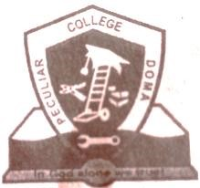

## Perculia School Doma

**Location**: Doma, Nasarawa State, Nigeria  
**Established**: 2006  
**Founder**: Stephen Obarezi  
**Type**: Private Nursery, Primary and Secondary School  
**Summary**: Perculia School Doma, founded by Stephen Obarezi, provides quality education from nursery to secondary levels. Committed to academic excellence and holistic development, the school offers a nurturing environment, fostering intellectual, social, and moral growth for students in Nasarawa State.
